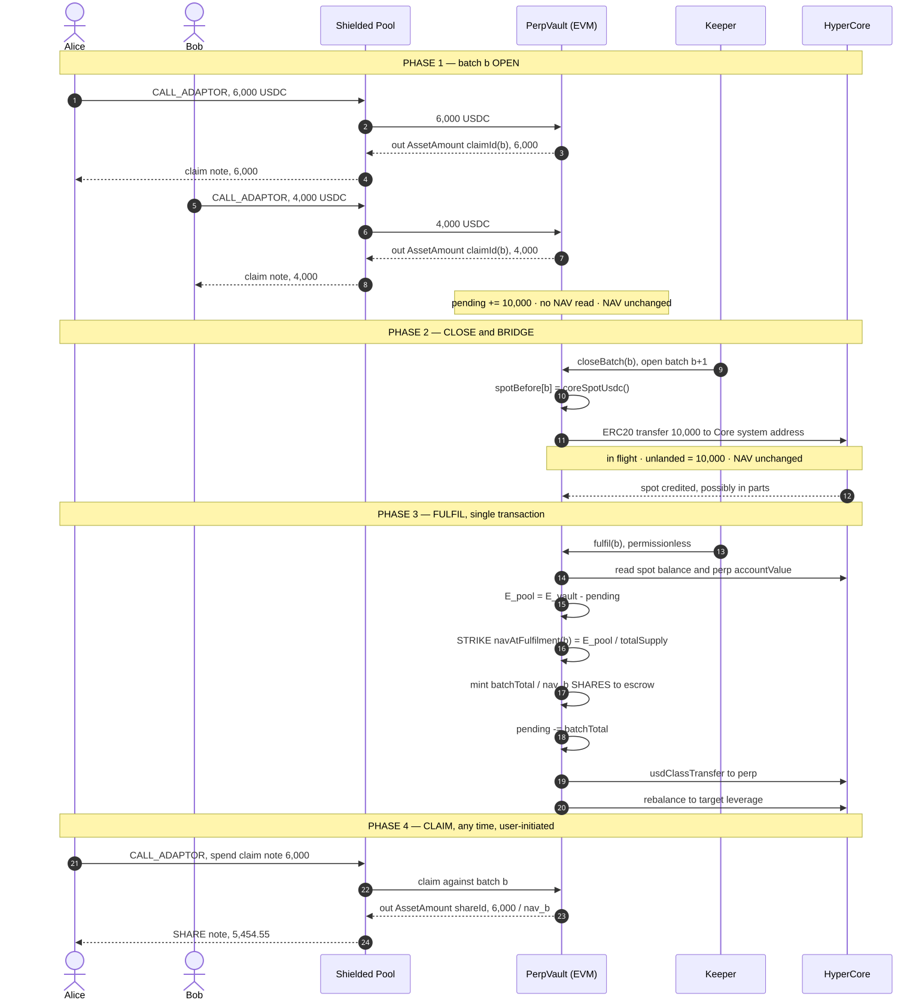

# Shielded Hyperliquid Perp Vault (Veilnyx <> Hyperliquid)

## Introduction

**Veilnyx <> Hyperliquid integration: Batched Vault design.**

Veilnyx operates fixed-strategy leveraged vaults on HyperCore — `BTC-LONG-10x`,
`ETH-LONG-2x` and so on. Each vault runs a rule, not a discretionary mandate: asset,
direction and target leverage are fixed, and the vault rebalances to hold that leverage.
A depositor chooses which vault to enter and how much to put in; the strategy itself is
not theirs to steer.

What the integration adds is **private ownership**. Deposits are ordinary shielded
Veilnyx transactions, so vault shares are held in an encrypted note rather than by a
visible address. The claim, stated precisely:

> This is a leveraged token with private ownership. The vault's position is public on
> Hyperliquid and openly Veilnyx's. What is hidden is *who owns the shares*.

Position-level privacy is **not** offered and should not be inferred: the vault's size,
direction, entry and liquidation price are public and permanently attributable to
Veilnyx. Deposit and redemption amounts are public as well — the depositor is not.

**What this document covers.** The deposit path only: from USDC entering the shielded
pool to SHARE notes in the depositor's hands. It is a *batch* design — deposits
accumulate, bridge to HyperCore together, and are priced once the money has landed.
Redemption is a separate flow, not drawn here.

Numbers throughout are one continuous worked example: a vault at equity 22,000 /
supply 20,000 / NAV 1.1000, target 2x. Batch 1 = Alice 6,000 + Bob 4,000.

**Terms used throughout.**

```
E_vault    everything the vault holds: perp margin + HyperCore spot + idle
           HyperEVM USDC + unlanded

unlanded   batch capital that has left HyperEVM but has not yet been credited on
           HyperCore — in flight, visible on neither chain, counted anyway

pending    capital from batches not yet priced — held by the vault, but owed to
           claim-note holders rather than to shareholders

E_pool     E_vault − pending, the equity that actually belongs to shareholders

NAV        E_pool / shares outstanding
```

Subtracting `pending` is what stops an arriving batch from moving the price for the
holders already in the vault.

---

## Problems this design addresses

**1. Vault offers alternative to round-trip cost of the tx-per-account design (Obscurification design):** <br> 
The established pattern for private
Hyperliquid exposure is obscuration by fresh account: withdraw from the privacy protocol
to a burner, register a Hyperliquid account, trade from it, then bring the proceeds back
through a newly registered account and an internal transfer. Per position, that is:

```
burner route — per position                this design — per deposit
──────────────────────────────────────     ────────────────────────────────
1  withdraw from pool to burner            1  deposit  → claim note
2  register Hyperliquid account            2  claim    → SHARE note
3  open position
4  close position
5  register Veilnyx account
6  deposit proceeds
7  internal transfer to original account
```

- **Registration does not amortise.** One registration per *position*, not per user. The
  cost scales with how often you trade, which is the wrong thing for it to scale with.
- **Gas per round trip is strictly higher.** Registration, deposit and internal transfer
  are paid every time. Here a deposit is one shielded call, and the claim is the only
  other step.


What the burner route buys and this design does not is **discretion**: the trader picks
asset, direction, leverage, entry and exit. A vault is a fixed rule, and the only choice
is which vault to enter. This design targets the depositor who wants leveraged exposure
repeatedly, not the trader who wants one bespoke position.

**2. Batching fixes sync share allotment against a stale NAV:** <br> 
Shares must be priced at the NAV that holds once
the deposit has landed on HyperCore — not at the NAV when it was deposited. Bridging is
asynchronous and the vault is leveraged, so equity moves with the underlying while the
deposit is in flight.

Alice deposits 6,000. The underlying falls 5% before her USDC lands; at 2x, vault equity
goes 22,000 → 19,800 and NAV goes 1.1000 → 0.9900:

```
priced at deposit        6,000 / 1.1000  =  5,454.55 shares    ← stale
nav_fulfilment[b]        6,000 / 0.9900  =  6,060.61 shares    ← correct
```

Same 6,000, 606 shares apart. Alice ends up 471 USDC short and the existing holders 471
up — and had the market moved the other way, the transfer runs the other way. A stale
price is not merely imprecise: it is a free option for anyone who can time the bridge
window.

---

## 1. Full lifecycle



### Step by step

Numbers match the diagram's `autonumber`. Read as a Hyperliquid trader: you are buying
into a leveraged perp book through a pool that never links your deposit to your shares.

**Phase 1 — batch b OPEN.** Nothing is priced here.

1. **Alice deposits.** 6,000 USDC into the shielded `Pool`, `CALL_ADAPTOR` targeting the
   vault. The amount is public; who is depositing is not.
2. **Pool funds the vault.** The 6,000 lands as idle EVM USDC — cash, not margin.
3. **Vault returns the out-asset.** 6,000 units of `claimId(b)`, the token unique to this
   batch.
4. **Pool writes Alice's claim note.** A private receipt for 6,000 USDC in batch b. 1:1,
   no NAV read — so there is no price to go stale.
5. **Bob deposits.** Same call, 4,000 USDC, same open batch.
6. **Pool funds the vault.** Idle EVM balance now 10,000.
7. **Vault returns the out-asset.** Same `claimId(b)` — Bob's units are fungible with
   Alice's, and only because they share a batch.
8. **Pool writes Bob's claim note.** 4,000. `pending` = 10,000, NAV still 1.1000.

*Trader's read:* your deposit is parked cash, not a position. Zero perp exposure, zero
PnL, until step 20.

**Phase 2 — CLOSE and BRIDGE.** The batch crosses to HyperCore.

9. **Keeper closes b, opens b+1.** Membership in b is frozen; later deposits go to b+1.
10. **Vault snapshots Core spot.** `spotBefore[b]` is the "before" mark that lets step 13
    prove the money actually landed.
11. **Vault bridges 10,000** to the Core system address — the ordinary EVM→Core USDC
    transfer.
12. **Core credits spot, possibly in parts.** Between 11 and 12 the money is invisible to
    both chains; `unlanded` is derived from the gap, so NAV reads flat throughout.

*Trader's read:* still no exposure. Bridge latency costs you idle time, never price.

**Phase 3 — FULFIL, one transaction.** The only step that fixes anything.

13. **Anyone calls `fulfil(b)`.** Permissionless — the keeper is convenience, not trust.
    Reverts unless the full 10,000 has landed.
14. **Vault reads Core:** spot balance + perp `accountValue`. Live equity, post-bridge.
15. **Derive `E_pool` = `E_vault` − `pending` = 22,000.** Removing `pending` strips out the
    batch's own capital, so the batch cannot price itself.
16. ★ **STRIKE.** `navAtFulfilment(b)` = 22,000 / 20,000 = 1.1000. Write-once. This is
    Alice's and Bob's entry price, fixed *after* their money arrived, not at deposit.
17. **Mint 10,000 / 1.1000 = 9,090.91 SHARE to escrow.** Vault-held, but counted in
    `totalSupply` from this instant, so unclaimed shares track NAV.
18. **`pending` −= 10,000.** Liability discharged; the capital is shareholders' now.
19. **`usdClassTransfer` to perp.** Spot → margin. No fill, no fee, NAV-neutral.
20. **Rebalance to target leverage.** The vault sizes the perp position to 2x. First moment
    the new capital carries exposure, and the only step that moves NAV — by its taker fee
    (9.00 in §4's table, 1.1000 → 1.09969).

*Trader's read:* exposure begins at 20, priced at the NAV struck at 16. How the taker cost
of your own entry is split between you and incumbent holders is not yet settled.

**Phase 4 — CLAIM, user-initiated, any time.**

21. **Alice spends her claim note** through the `Pool` — 6,000 units of `claimId(b)`.
22. **Pool calls the vault** to claim against batch b. Requires `navAtFulfilment(b) != 0`;
    before the strike there is no rate to convert at.
23. **Vault returns the out-asset:** `shareId`, 6,000 / 1.1000, rounded down.
24. **Pool writes Alice's SHARE note:** 5,454.55, drawn from escrow. Bob's 3,636.36 sits
    there until he claims.

*Trader's read:* claiming is a wrapper swap, not a trade. Waiting a month costs nothing —
the escrowed shares were tracking NAV the whole time. Redemption is a separate flow, not
drawn here.

Phases 1–2 leave NAV untouched by construction. Phase 3's strike is value-neutral.
Only the rebalance at the end of phase 3 moves NAV, by its taker fee — a real trading
cost, not an artefact of the batching.

---

## 2. Batching and serialization

A batch accepts deposits at any time. It may not **bridge** until the previous batch
has fulfilled. One batch in flight, ever.

```
 B1  ├── open ──┤├─ bridge ─┤├ fulfil ┤├───── claims, open-ended ─────────►
 B2             ├────────── open ─────────────┤├─ bridge ─┤├ fulfil ┤├── claims ──►
                                               ▲
                          B2 may take deposits throughout, but may not
                          bridge until B1 has fulfilled ────────────────┘
```

Consequences:

- **Deposit time within a batch is economically irrelevant.** Alice at 09:00 and Bob at
  17:00 are struck at the same `nav_b`. This is deliberate — if timing inside the window
  changed the price, the late-trading option would be back.
- **Only batch membership matters**, and it is fixed at deposit time by the claim note's
  assetId. It cannot be changed retroactively.
- Arriving early costs idle time, not price. Deposits will tend to bunch near the close.

---

## 3. CLAIM token allotment

One rule, no NAV, no formula:

```
claimTokens = D          (minus an entry fee, if one is adopted)
```

The claim note is a receipt denominated in the deposited asset. That is precisely why
no NAV is read at deposit, and why the stale-NAV problem has nowhere to enter.

```
Alice  6,000 USDC  ──►  Poseidon( claimId[vault][1], aliceRefund, 6,000 )
Bob    4,000 USDC  ──►  Poseidon( claimId[vault][1], bobRefund,   4,000 )
                                  └── same id = same batch = same divisor later
```

Claim tokens are **fungible within a batch, never across batches**. A different batch is
a different registered asset with a different divisor. This is why ids are never
recycled: reusing an id would silently make a stale note fungible with new ones and
convert it at a divisor struck at an unrelated time.

---

## 4. The strike

`nav_fulfilment` is computed on the pool **as it stands without the batch**, in the same
transaction that writes it, immediately before the mint.

```
┌─ fulfil(b) — single transaction ────────────────────────────────────────┐
│
│  0  VERIFY      spotUsdc() − spotBefore[b] ≥ batchTotal[b]
│                 else revert — the batch has not landed
│
│  1  READ        E_vault = perp 22,000 + spot 10,000 + idleEVM 5,000
│                         + unlanded 0                          = 37,000
│                 pending = 10,000 (B1) + 5,000 (B2)            = 15,000
│
│  2  DERIVE      E_pool  = E_vault − pending                   = 22,000
│                 S_out   = shareToken.totalSupply()            = 20,000
│
│  3  ★ STRIKE    navAtFulfilment[vault][b] = E_pool / S_out    =  1.1000
│                 write-once · never revised · claim timing inert
│
│  4  MINT        escrow += batchTotal[b] / nav_b
│                        =  10,000 / 1.1000                     = 9,090.91
│                 pending −= batchTotal[b]                      →  5,000
│
│  5  MOVE        usdClassTransfer(10,000, toPerp)              NAV-neutral
│  6  DEPLOY      rebalance to target leverage        ← only step that moves NAV
│
└─────────────────────────────────────────────────────────────────────────┘
```

Three things the ordering enforces, each load-bearing:

| | |
|---|---|
| `pending` still contains B1 at step 3 | else `E_pool` reads 32,000 and the batch is priced against its own capital |
| supply is read at step 2, before the mint at step 4 | both sides of the ratio exclude the batch — this is the pre-deposit NAV rule |
| deploy happens at step 6, after the strike | pending capital stays economically inert, so no PnL accrues with no shares against it |

**NAV continuity** — the whole point, checkable line by line:

```
#  event                        idleEVM  unland    spot     perp  pending      supply      NAV
--------------------------------------------------------------------------------------------------
0  steady state                       0       0       0   22,000        0      20,000   1.1000
1  Alice deposits 6,000 -> B1     6,000       0       0   22,000    6,000      20,000   1.1000
2  Bob   deposits 4,000 -> B1    10,000       0       0   22,000   10,000      20,000   1.1000
3  B1 closes, B2 opens           10,000       0       0   22,000   10,000      20,000   1.1000
4  bridge B1, spotBefore = 0          0  10,000       0   22,000   10,000      20,000   1.1000
5  Carol deposits 5,000 -> B2     5,000  10,000       0   22,000   15,000      20,000   1.1000
6  Core credits 4,000 of B1       5,000   6,000   4,000   22,000   15,000      20,000   1.1000
7  Core credits final 6,000       5,000       0  10,000   22,000   15,000      20,000   1.1000
8  fulfil(1): strike + mint       5,000       0  10,000   22,000    5,000  29,090.91   1.1000
9  usdClassTransfer lands         5,000       0       0   32,000    5,000  29,090.91   1.1000
10 rebalance fills, fee 9.00      5,000       0       0   31,991    5,000  29,090.91   1.09969
```

Flat at 1.1000 across the invisible in-flight window (#4) and the partial credit (#6).
It moves only at #10, where a real cost is paid.

---

## 5. Escrow and SHARE minting

Shares are minted **at the strike**, into vault-held escrow — not lazily at claim. If
minting were deferred, `totalSupply()` would under-report economically outstanding
shares for the whole unclaimed window and every later strike would divide by a number
that is too small.

```
   ★ strike, nav_1 = 1.1000
            │
            ▼
   ┌──────────────────┐
   │  escrow          │  minted once:  10,000 / 1.1000  =  9,090.91 SHARE
   │     9,090.91     │  counted in totalSupply from this instant
   └──────────────────┘
            │
            │  claims — any time, any order, rate already fixed
            │
            ├──►  Alice   6,000 / 1.1000  =  5,454.55  SHARE note
            └──►  Bob     4,000 / 1.1000  =  3,636.36  SHARE note
                                             ─────────
                                             9,090.91   escrow drains to 0
```

Because escrowed shares are in `totalSupply` from the strike onward, they track NAV
while unclaimed. **A late claimer loses nothing** — not exposure, not P&L. Claim timing
is inert in both directions.

Partial claims fall out for free: notes split, so claiming 3,000 of a 10,000 claim note
yields `3,000 / 1.1000 = 2,727.27` shares and leaves a 7,000 claim note at the same rate.
Rounding is always down, per 4626 discipline, so escrow can never under-run and the last
claimant never reverts.
