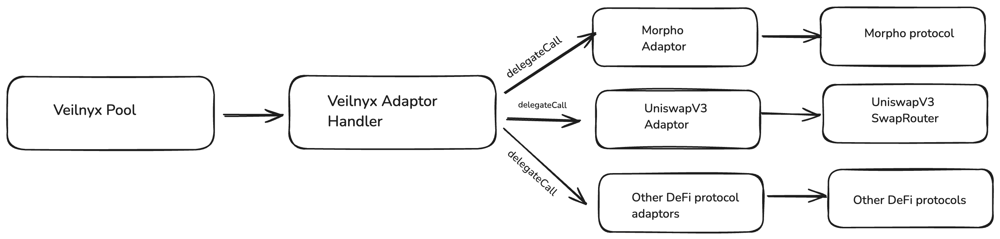

# Veilnyx Protocol — Adaptor Design for Morpho Vault Lending

## 1. Overview

Veilnyx is a privacy-preserving DeFi protocol that enables users to interact with external protocols (Morpho, Aave, Curve, RocketPool, etc.) without revealing their identity or transaction graph. It achieves this through **shielded transactions** — ZK-proven operations that spend encrypted input notes and produce encrypted output notes, all anchored in on-chain Merkle trees.

This document focuses on how the **adaptor architecture** enables private lending on **Morpho Vaults**, covering the end-to-end flow from shielded note consumption to output note creation.

---

## 2. Adaptor Architecture



### 2.1 Core Components

| Component | Role |
|---|---|
| **Pool** | Holds user assets as encrypted UTXO commitments in a Merkle tree. Entry point for all shielded transactions. |
| **AdaptorHandler** | Intermediary that receives assets from the Pool, forwards them to the target adaptor, and returns output assets. |
| **MorphoVaultAdaptor** | Concrete adaptor that deposits into or withdraws from a Morpho Vault on behalf of the Pool. |


## 3. MorphoVaultAdaptor Contract

### 3.1 Payload Encoding

The caller (the ZK circuit's public payload, embedded in `ShieldedTransaction.targetData`) encodes two values:

```solidity
(Action action, address morphoVault) = abi.decode(payload, (Action, address));
```

| Field | Type | Description |
|---|---|---|
| `action` | `Action` (enum: `DEPOSIT=0`, `WITHDRAW=1`) | Whether to supply or redeem |
| `morphoVault` | `address` | The ERC-4626 Morpho Vault address |

### 3.2 Deposit Flow (`Action.DEPOSIT`)

```solidity
function _deposit(
    uint24 inAssetId,
    uint256 inValue,
    IMorphoVault morpho
) internal returns (uint24 outAssetId, uint256 outValue);
```
1. **Approve & deposit** — `forceApprove` the vault, then call `morpho.deposit(inValue, address(this))`.
2. **Return vault shares** — The returned `shares` count becomes `outValue`; `outAssetId` is resolved via `getAsset(address(morpho)).id` (the vault share token registered in the Pool).

### 3.3 Withdraw Flow (`Action.WITHDRAW`)

```solidity
function _withdraw(
    uint24 inAssetId,
    uint256 inValue,
    IMorphoVault morpho
) internal returns (uint24 outAssetId, uint256 outValue);
```
1. **Redeem** — Burns vault shares and receives the underlying token.
2. **Return underlying** — `outAssetId` is the underlying token's ID; `outValue` is the amount redeemed.

### 3.4 `handleAssets` Entry Point

```solidity
function handleAssets(
    uint24[] calldata inAssetIds,
    uint256[] calldata inValues,
    bytes calldata payload
) external payable returns (uint24[] memory outAssetIds, uint256[] memory outValues);
```

- Decodes the payload.
- Delegates to `_deposit` or `_withdraw`.
- Returns exactly **one** output asset (single-element arrays).

---

## 4. Shielded Transaction Lifecycle for a Morpho Deposit

The diagram below traces a `CALL_ADAPTOR` shielded transaction that deposits USDC into a Morpho Vault and returns vault shares to the sender — all without revealing the sender's identity.

```
User (off-chain)
  │
  │  1. Build ShieldedTransaction (txType = CALL_ADAPTOR)
  │     - Spend input notes (USDC) → nullifiers
  │     - pubAssets = [{id: USDC_ID, value: 1000e6}]
  │     - targetData = adaptorAddress ++ abi.encode(DEPOSIT, morphoVaultAddr)
  │     - refundAddress = blinded public key of sender
  │     - proof = ZK proof of note ownership & spend validity
  │
  ▼
Pool.transact(stx)
  │
  │  2. Validate
  │     - Verify ZK proof
  │     - Check Merkle roots (address tree, commitment tree)
  │     - Mark nullifiers (prevents double-spend)
  │     - Confirm adaptor is whitelisted
  │
  │  3. Execute
  │     a. _transferPubAssets → send USDC to AdaptorHandler
  │     b. _handleAdaptorCall
  │        │
  │        ▼
  │     AdaptorHandler.handleAdaptor(adaptorAddr, pubAssets, payload)
  │        │
  │        │  Transfers USDC to MorphoVaultAdaptor
  │        │  Calls adaptor.handleAssets(...)
  │        │
  │        ▼
  │     MorphoVaultAdaptor._deposit(USDC_ID, 1000e6, morphoVault)
  │        │  → IERC20(USDC).forceApprove(morphoVault, 1000e6)
  │        │  → morphoVault.deposit(1000e6, address(this))
  │        │  ← shares (e.g., 980e6 vault tokens)
  │        │
  │        │  Returns outPubAssets = [{id: VAULT_ID, value: 980e6}]
  │        ▼
  │     AdaptorHandler transfers vault shares back to Pool
  │
  │  4. _receivePubAssets → Pool receives vault shares
  │
  │  5. Create output commitments (refund notes)
  │     For each outPubAsset:
  │       commitment = Poseidon(assetId, refundAddress, value)
  │     Append commitments to the commitment tree queue
  │
  │  6. Emit Receipt event with encrypted notesMemo + refundMemo
  │
  ▼
Commitment tree updated (via processQueue)
```

---

### 5.3 Why This Matters for Morpho

When a user deposits USDC into a Morpho Vault through Veilnyx:

- **On-chain observers** see: *"Some adaptor deposited X USDC into Morpho and received Y vault shares, which are now committed in the Veilnyx tree."*
- **They cannot determine**: *Who* owns those vault shares, because `refundAddress` is blinded and the commitment is a Poseidon hash.
- **The user** can later spend the vault share note (e.g., to withdraw from Morpho) by proving ownership in a new shielded transaction.

---

## 6. Security Properties

| Property | Mechanism |
|---|---|
| **No double-spend** | Nullifiers are marked in `_checkAndMarkNullifiers`; reuse reverts with `DoubleSpend`. |
| **Adaptor whitelisting** | `supportedAdaptors[target]` is checked during validation. |
| **Output ownership** | `refundAddress` is proven in the ZK circuit to belong to the sender. |
| **Value integrity** | Input note values are proven in-circuit; output values are determined on-chain and committed via Poseidon hash. |
| **Deposit validation** | `_deposit` checks `inAsset.assetAddress == morpho.asset()` — prevents depositing the wrong token. |

---

## 7. Summary

The Veilnyx adaptor design cleanly separates **privacy logic** (shielded transactions, ZK proofs, Merkle trees) from **DeFi logic** (Morpho deposits/withdrawals). The `MorphoVaultAdaptor` is a thin wrapper around the ERC-4626 vault interface, while the Pool and `_handleAdaptorCall` handle the complex task of binding unknown output values to the sender's blinded identity via `refundAddress` commitments. This pattern generalises to any yield venue — only the adaptor's `handleAssets` implementation changes.